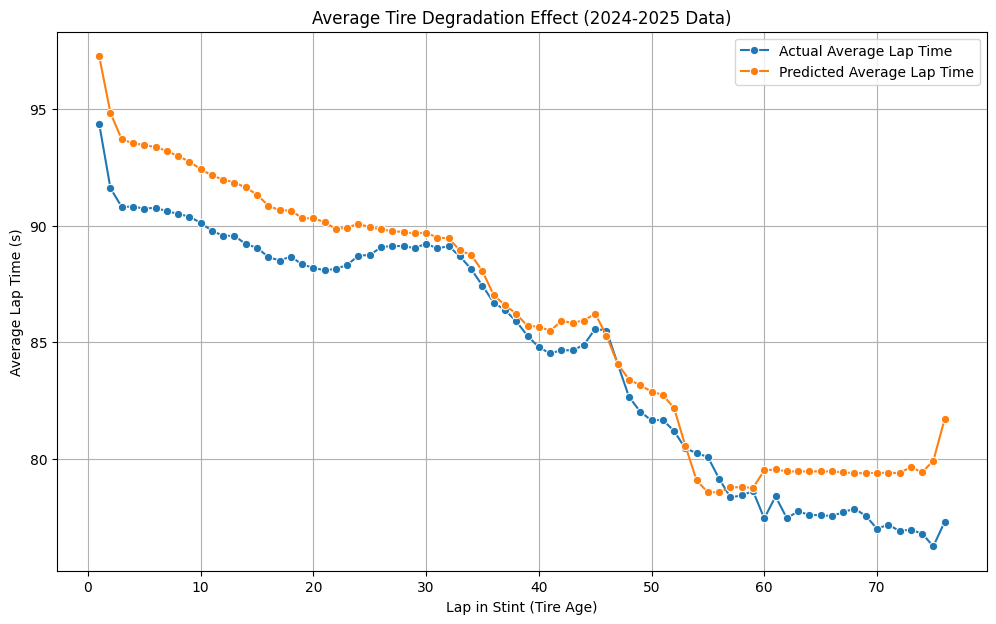

# F1 Race Strategy Analysis: Using Lap Time Prediction to Model Tire Degradation and the Undercut

### **Project by: Jeet Prajapati**

This project uses a public Kaggle dataset to develop a machine learning pipeline for analyzing and simulating Formula 1 race strategy. The core of the project is a pace model that predicts lap times by modeling the effects of tire degradation, which is then used to power higher-level strategic tools like a pit stop predictor and an undercut calculator.

---

### **Project Components**
1.  **Exploratory Data Analysis (EDA):** Analyzed historical F1 data to uncover trends in car reliability, driver performance, and the evolution of the sport.
2.  **Pace & Degradation Model:** An XGBoost regression model trained to predict lap times based on tire age (`LapInStint`), track, team, and grid position.
3.  **"When to Pit?" Model:** A Random Forest classification model that uses simulations from the Pace Model to predict the optimal moment for a pit stop.
4.  **Hyperparameter Tuning:** Optimized the Pace Model using `RandomizedSearchCV` to test the limits of performance based on the available features.
5.  **Undercut Advantage Calculator:** A simulation function that leverages the Pace Model to quantify the time advantage of performing an undercut on a rival.

---

### **Key Results**
* **Pace Model Performance:** The model successfully learned the tire degradation trend, achieving an **R² of 0.701**. The final **Mean Absolute Error was 3.929 seconds**.
* **Strategy Model Performance:** The pit-stop classifier was highly effective, with a **Precision of 0.94** and a **Recall of 0.89** for the minority "pit" class.
* **Strategic Insight:** The Undercut Calculator successfully identified a **1.350-second advantage** in a real historical race scenario (Hamilton vs. Verstappen, Bahrain 2021).



---

### **Tech Stack**
* **Libraries:** Python, Pandas, Scikit-Learn, XGBoost, Matplotlib, Seaborn, Kaggle
* **Environment:** Jupyter Notebook (via Google Colab)

---

### **How to Run**
1.  **Clone Repository:**
    ```bash
    git clone [F1 Strategy Project](https://github.com/PrajapatiJeet/F1_Strategy_Project.git)
    cd F1_Strategy_Project
    ```
2.  **Kaggle API Key & Data:**
    * The notebook is configured to download the dataset directly. Go to your Kaggle account page and download your `kaggle.json` API token.
    * The required dataset is the [Formula 1 World Championship (1950-2020) dataset on Kaggle](https://www.kaggle.com/datasets/rohanrao/formula-1-world-championship-1950-2020).
    * Place your `kaggle.json` file in the root directory of the project before running the notebook.
3.  **Install Dependencies:**
    ```bash
    pip install -r requirements.txt
    ```
4.  **Run Notebook:**
    * Open and run the `f1_degradation_undercut.ipynb` notebook in a Jupyter environment like Google Colab.
